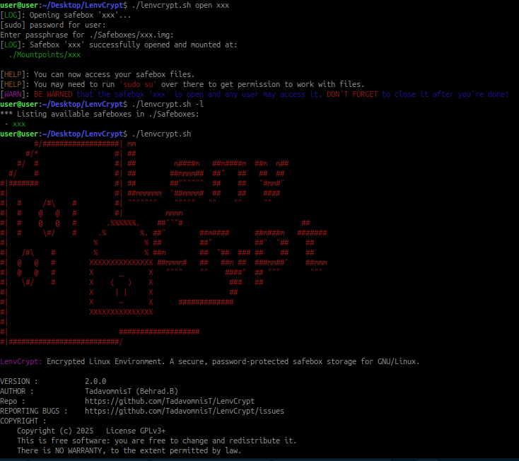

# LenvCrypt


**LenvCrypt**: **L**inux **Env**ironment En**crypt**ed, is a secure, password-protected safebox storage designed to create an encrypted environment on GNU/Linux systems. LenvCrypt works based on _LUKS_, and aims to provide users with a safe space to run programs and store sensitive data a part of the host system without the risk of exposure.


## Features

- **Encryption**: All data within the LenvCrypt environment is encrypted using strong encryption algorithms to ensure confidentiality. Access to the safebox is secured with a user-defined password.

- **Open Source**: LenvCrypt is licensed under the GPL3, allowing users to modify and distribute the software freely.

- **Cross-Platform Compatibility**: Designed to work on various GNU/Linux distributions.

## Installation

To install LenvCrypt, follow these steps:

1. **Install dependencies**:
   Make sure you have the _cryptsetup_ installed. You can typically install them using your package manager. For example, on Debian-based systems:
   ```bash
   sudo apt-get install cryptsetup
   ```

2. **Clone the repository and setup**:
   ```bash
   git clone https://github.com/TadavomnisT/LenvCrypt.git
   cd LenvCrypt
   chmod +x lenvcrypt.sh
   ```

3. **Run the program**:
   ```bash
   ./lenvcrypt.sh
   ```

## Usage


```shell
Usage: ./lenvcrypt.sh <command> [options/safebox_name] [extra_option]

Commands:
  create (-c, --create) => Create a new safebox.
                   The script will prompt for a safebox name and a size.
                   Example: ./lenvcrypt.sh create
                            ./lenvcrypt.sh -c mysafebox

  open (-o, --open)   => Open an existing safebox.
                   Example: ./lenvcrypt.sh open mysafebox
                            ./lenvcrypt.sh --open mysafebox

  close (-c, --close)  => Close an opened safebox.
                   Example: ./lenvcrypt.sh close mysafebox
                            ./lenvcrypt.sh -c mysafebox

  list (-l, --list)   => List all existing safeboxes.
                   Example: ./lenvcrypt.sh list
                            ./lenvcrypt.sh --list

  delete (-d, --delete) => Delete an existing safebox.
                   This removes the .img file and associated mountpoint.
                   Example: ./lenvcrypt.sh delete mysafebox
                            ./lenvcrypt.sh -d mysafebox

  export (-e, --export) => Export a safebox image to a specified file.
                   Example: ./lenvcrypt.sh export mysafebox /path/to/export.img
                            ./lenvcrypt.sh --export mysafebox /path/to/export.img

  import (-i, --import) => Import a safebox image from a file.
                   The safebox will be stored as <safebox_name>.img.
                   Example: ./lenvcrypt.sh import mysafebox /path/to/import.img
                            ./lenvcrypt.sh -i mysafebox /path/to/import.img

  version (-v, --version) => Display LenvCrypt version.
                   Example: ./lenvcrypt.sh version
                            ./lenvcrypt.sh --version

  help (-h, --help)    => Display this help information.
                   Example: ./lenvcrypt.sh help
                            ./lenvcrypt.sh -h
```

```bash
./lenvcrypt.sh <command> [options/safebox_name] [extra_option]
```

**Commands:**

- **create**  
  Create a new safebox. The script will prompt for a safebox name and a size if not provided.  
  ```bash
  ./lenvcrypt.sh create
  ./lenvcrypt.sh -c mysafebox
  ```

- **open**  
  Open an existing safebox.  
  ```bash
  ./lenvcrypt.sh open mysafebox
  ./lenvcrypt.sh --open mysafebox
  ```

- **close**  
  Close an opened safebox.  
  ```bash
  ./lenvcrypt.sh close mysafebox
  ./lenvcrypt.sh -c mysafebox
  ```

- **list**  
  List all existing safeboxes.  
  ```bash
  ./lenvcrypt.sh list
  ./lenvcrypt.sh --list
  ```

- **delete**  
  Delete an existing safebox. This command removes the .img file and its associated mountpoint.  
  ```bash
  ./lenvcrypt.sh delete mysafebox
  ./lenvcrypt.sh -d mysafebox
  ```

- **export**  
  Export a safebox image to a specified file.  
  ```bash
  ./lenvcrypt.sh export mysafebox /path/to/export.img
  ./lenvcrypt.sh --export mysafebox /path/to/export.img
  ```

- **import**  
  Import a safebox image from a file. The safebox will be stored as <safebox_name>.img.  
  ```bash
  ./lenvcrypt.sh import mysafebox /path/to/import.img
  ./lenvcrypt.sh -i mysafebox /path/to/import.img
  ```

- **version**  
  Display LenvCrypt version.  
  ```bash
  ./lenvcrypt.sh version
  ./lenvcrypt.sh --version
  ```

- **help**  
  Display help information about the usage and commands.  
  ```bash
  ./lenvcrypt.sh help
  ./lenvcrypt.sh -h
  ```

## Important Warning

**BE WARNED** that if a safebox is open, any user on your system may access it. **DON'T FORGET to close the safebox after you're done** to ensure the security of your encrypted storage.

When a safebox is open, its decrypted content (plain data) is mounted and accessible via a mountpoint (located in the `./Mountpoints/` directory), meaning the security provided by encryption remains only active when the safebox is closed. ***Always close your safebox when you are not using it.***


## How does it work?

LenvCrypt uses LUKS (_Linux Unified Key Setup_) to provide a secure, encrypted container where you can safely store and work with files. LUKS is a widely adopted standard for Linux disk encryption that implements a platform-independent on-disk format. This guarantees compatibility and interoperability between various programs and operating systems while ensuring secure password management (as described on [Wikipedia](https://en.wikipedia.org/wiki/Linux_Unified_Key_Setup)).

Using LUKS, LenvCrypt creates an encrypted disk image (a file with a .img extension) that serves as a container for your safebox. Here’s a an overview of what goes under the hood:

- **Creating a Safebox:**  
  LenvCrypt first creates an empty disk image of a specified size. It then encrypts the image using LUKS, prompting you for a password during setup. After formatting the encrypted container with the ext4 filesystem, a dedicated mount point is created for later use.

- **Opening a Safebox:**  
  When you open a safebox, LenvCrypt uses your password to unlock (decrypt) the LUKS container. The encrypted disk image is then mounted to a designated mount point (`./Mountpoints/<safebox_name>`) so that you can access and modify the files stored inside.

- **Closing and Deleting Safeboxes:**  
  Closing a safebox involves unmounting the filesystem and relocking the LUKS container to ensure that no unauthorized access is possible while the safebox is not in use. The delete command will permanently remove the disk image and its associated mount point (with user confirmation), so be sure to close and back up your safebox if necessary before deleting it.

This design ensures that your safebox files remain encrypted at rest and only become accessible when you intentionally unlock and mount the container. This approach provides an extra layer of security for sensitive data while using Linux.

### Safebox.img Format

Inspecting `.img` files will provide a detailed explanation of what goes on under the hood:
```shell
file Safebox.img 
Safebox.img: LUKS encrypted file, ver 2, header size 16384, ID 3, algo sha256, salt 0x*********..., UUID: ****-*****-****-****-********, crc **************..., at 0x1000 {"keyslots":{"0":{"type":"luks2","key_size":64,"af":{"type":"luks1","stripes":4000,"hash":"sha256"},"area":{"type":"raw","offse
``` 
This output also includes metadata about the hash algorithm, salt value, encryption algorithm, etc., presented in JSON format. For further investigation, you can check out LUKS online.

## ScreenShots




## Contributing

Feel free to get involved! If you would like to contribute to LenvCrypt, please follow these steps:

1. Fork the repository.
2. Add a feature or fix a bug!
3. Make your changes and commit them with clear messages (Explain what you did).
4. Open a pull request with a description of your changes.


## License

LenvCrypt is licensed under the [GNU General Public License v3.0](https://www.gnu.org/licenses/gpl-3.0.html). See the LICENSE file for more details.

## Contact

For questions, suggestions, or feedback, please open an issue in the repository or contact me at behroora at YAHOO dot COM.
