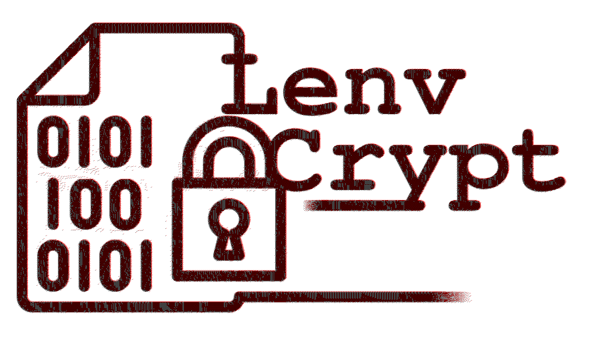

# LenvCrypt

 LenvCrypt: Encrypted Linux Environment. A secure, password-protected sandbox storage for GNU/Linux. 



**LenvCrypt**: **L**inux **Env**ironment En**crypt**ed, is a secure, password-protected sandbox storage designed to create an encrypted environment on GNU/Linux systems. LenvCrypt works based on _LUKS_, and aims to provide users with a safe space to run programs and store sensitive data a part of the host system without the risk of exposure.


## Features

- **Encryption**: All data within the LenvCrypt environment is encrypted using strong encryption algorithms to ensure confidentiality. Access to the sandbox is secured with a user-defined password.

- **Open Source**: LenvCrypt is licensed under the GPL3, allowing users to modify and distribute the software freely.

- **Cross-Platform Compatibility**: Designed to work on various GNU/Linux distributions.

## Installation

To install LenvCrypt, follow these steps:

1. **Install dependencies**:
   Make sure you have the _cryptsetup_ installed. You can typically install them using your package manager. For example, on Debian-based systems:
   ```bash
   sudo apt-get install cryptsetup
   ```

2. **Clone the repository and setup**:
   ```bash
   git clone https://github.com/TadavomnisT/LenvCrypt.git
   cd LenvCrypt
   chmod +x lenvcrypt.sh
   ```

3. **Run the program**:
   ```bash
   ./lenvcrypt.sh
   ```

## Usage


```shell
Usage: ./lenvcrypt.sh <command> [sandbox_name]

Commands:
  create    => Create a new sandbox.
                   The script will prompt for a sandbox name and a size.
                   Example: ./lenvcrypt.sh create
                            ./lenvcrypt.sh create mysandbox
  open      => Open an existing sandbox.
                   Example: ./lenvcrypt.sh open mysandbox
  close     => Close an opened sandbox.
                   Example: ./lenvcrypt.sh close mysandbox
  list      => List all existing sandboxes.
                   Example: ./lenvcrypt.sh list
  delete    => Delete an existing sandbox.
                   This will remove the .img file and associated mountpoint.
                   Example: ./lenvcrypt.sh delete mysandbox
  help, -h, --help
            => Display this help information.
```

```bash
./lenvcrypt.sh <command> [sandbox_name]
```

  **Commands:**

- **create**  
  Create a new sandbox. The script will prompt for both a sandbox name (if not provided) and a size.  
  ```bash
  ./lenvcrypt.sh create
  ./lenvcrypt.sh create mysandbox
  ```

- **open**  
  Open an existing sandbox.  
  ```bash
  ./lenvcrypt.sh open mysandbox
  ```

- **close**  
  Close an opened sandbox.  
  ```bash
  ./lenvcrypt.sh close mysandbox
  ```

- **list**  
  List all existing sandboxes.  
  ```bash
  ./lenvcrypt.sh list
  ```

- **delete**  
  Permanently delete an existing sandbox. This will remove both the `.img` file and its associated mountpoint.  
  ```bash
  ./lenvcrypt.sh delete mysandbox
  ```

- **help, -h, --help**  
  Display help information about the usage and commands.  
  ```bash
  ./lenvcrypt.sh help
  ```


## Important Warning

**BE WARNED** that if a sandbox is open, any user on your system may access it. **DON'T FORGET to close the sandbox after you're done** to ensure the security of your encrypted storage.

When a sandbox is open, its decrypted content (plain data) is mounted and accessible via a mountpoint (located in the `./Mountpoints/` directory), meaning the security provided by encryption remains only active when the sandbox is closed. ***Always close your sandbox when you are not using it.***


## How does it work?


LenvCrypt uses LUKS (_Linux Unified Key Setup_) to provide a secure, encrypted container where you can safely store and work with files. LUKS is a widely adopted standard for Linux disk encryption that implements a platform-independent on-disk format. This guarantees compatibility and interoperability between various programs and operating systems while ensuring secure password management (as described on [Wikipedia](https://en.wikipedia.org/wiki/Linux_Unified_Key_Setup)).

Using LUKS, LenvCrypt creates an encrypted disk image (a file with a .img extension) that serves as a container for your sandbox. Here’s a an overview of what goes under the hood:

- **Creating a Sandbox:**  
  LenvCrypt first creates an empty disk image of a specified size. It then encrypts the image using LUKS, prompting you for a password during setup. After formatting the encrypted container with the ext4 filesystem, a dedicated mount point is created for later use.

- **Opening a Sandbox:**  
  When you open a sandbox, LenvCrypt uses your password to unlock (decrypt) the LUKS container. The encrypted disk image is then mounted to a designated mount point (`./Mountpoints/<sandbox_name>`) so that you can access and modify the files stored inside.

- **Closing and Deleting Sandboxes:**  
  Closing a sandbox involves unmounting the filesystem and relocking the LUKS container to ensure that no unauthorized access is possible while the sandbox is not in use. The delete command will permanently remove the disk image and its associated mount point (with user confirmation), so be sure to close and back up your sandbox if necessary before deleting it.

This design ensures that your sandbox files remain encrypted at rest and only become accessible when you intentionally unlock and mount the container. This approach provides an extra layer of security for sensitive data while using Linux.


## ScreenShots

* I should add something here...


## Contributing

Feel free to get involved! If you would like to contribute to LenvCrypt, please follow these steps:

1. Fork the repository.
2. Add a feature or bug a fix!
3. Make your changes and commit them with clear messages (Explain what you did).
4. Open a pull request with a description of your changes.

## License

LenvCrypt is licensed under the [GNU General Public License v3.0](https://www.gnu.org/licenses/gpl-3.0.html). See the LICENSE file for more details.

## Contact

For questions, suggestions, or feedback, please open an issue in the repository or contact me at behroora at YAHOO dot COM.

